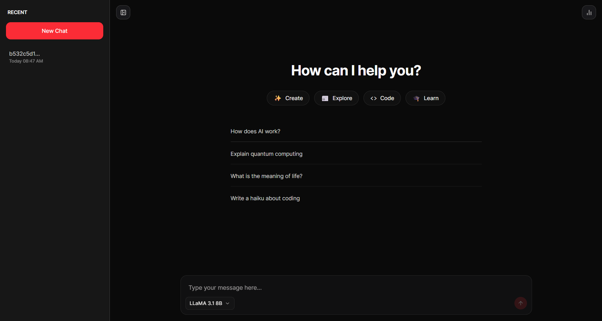
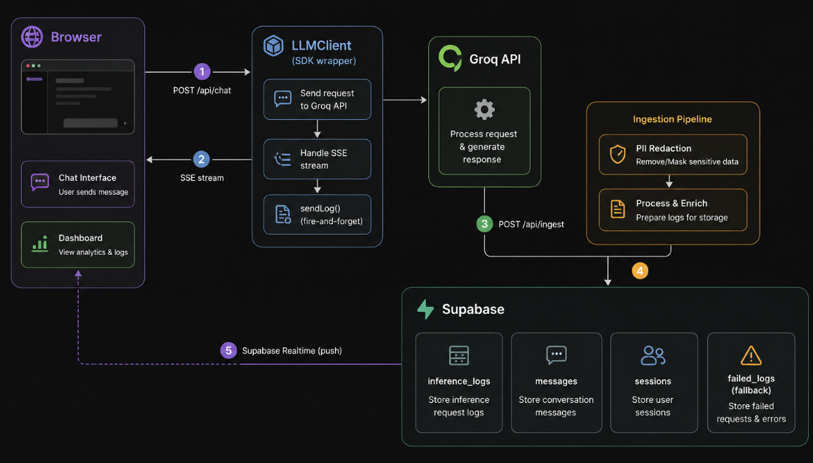

# t7.chat

A lightweight inference logging and observability system for LLM applications. Built to capture, store, and visualize inference metadata from multi-turn conversations in near real time.



## What it does

- Multi-turn chatbot with streaming responses via SSE
- SDK wrapper that captures inference metadata on every LLM call
- Fire-and-forget ingestion pipeline that never blocks the user
- PII redaction before anything is stored
- Real-time dashboard — latency, throughput, error rate
- Conversation management — list, resume, and cancel sessions


## Stack

| Layer | Choice | Why |
|---|---|---|
| Framework | Next.js 14 (App Router) | SSE, API routes, and UI in one deployment |
| Database | Supabase (Postgres) | Structured queries, Realtime, free tier |
| Inference | Groq API | Free tier, multiple open-source models, fast |
| Deployment | Vercel / Docker | Zero-config for Next.js, single-command Docker |


## Quick Start

### Option A — Docker (one command)

```bash
git clone https://github.com/Ethan4582/t7.chat
cd t7.chat
cp .env.example .env.production   # fill in your keys
docker compose up --build
```

App runs at `http://localhost:3000`

### Option B — Local dev

```bash
pnpm install
cp .env.example .env
pnpm dev
```

### Environment variables

```env
NEXT_PUBLIC_SUPABASE_URL=
NEXT_PUBLIC_SUPABASE_ANON_KEY=
SUPABASE_SERVICE_ROLE_KEY=
GROQ_API_KEY=
NEXT_PUBLIC_APP_URL=http://localhost:3000
```

### Supabase setup

Run this in your Supabase SQL editor once:

<details>
<summary><b>Click to show SQL setup</b></summary>

```sql
create table sessions (
  id text primary key,
  created_at timestamptz default now(),
  last_active timestamptz default now(),
  cancelled boolean default false
);

create table messages (
  id uuid primary key default gen_random_uuid(),
  session_id text references sessions(id),
  role text check (role in ('user', 'assistant')),
  content text,
  created_at timestamptz default now()
);

create table inference_logs (
  id uuid primary key default gen_random_uuid(),
  session_id text references sessions(id),
  provider text,
  model text,
  latency_ms int,
  prompt_tokens int,
  completion_tokens int,
  status text,
  input_preview text,
  output_preview text,
  created_at timestamptz default now()
);

create table failed_logs (
  id uuid primary key default gen_random_uuid(),
  payload jsonb,
  error text,
  created_at timestamptz default now()
);

-- RLS policies
alter table sessions enable row level security;
alter table messages enable row level security;
alter table inference_logs enable row level security;
alter table failed_logs enable row level security;

create policy "anon read sessions" on sessions for select using (true);
create policy "anon insert sessions" on sessions for insert with check (true);
create policy "anon read messages" on messages for select using (true);
create policy "anon insert messages" on messages for insert with check (true);
create policy "anon read inference_logs" on inference_logs for select using (true);
create policy "anon insert inference_logs" on inference_logs for insert with check (true);
create policy "anon insert failed_logs" on failed_logs for insert with check (true);
```
</details>

---

## Architecture



### Ingestion flow

1. `LLMClient` records a start timestamp, calls Groq, streams tokens to the browser
2. Once the stream ends, `sendLog()` fires a POST to `/api/ingest` — not awaited, user is unblocked
3. `/api/ingest` validates, redacts PII, writes to `inference_logs`
4. On any Supabase failure, payload is written to `failed_logs` instead
5. Endpoint always returns `200` — logging never affects the user

### Logging strategy

Metadata captured at two points:

| When | What |
|---|---|
| Pre-call | session ID, model, provider, input preview, timestamp |
| Post-call | latency, token estimate, status, output preview |

- Input/output previews capped at 100 chars after PII redaction
- Full message content stored separately in `messages` keeps `inference_logs` lean

### PII redaction

`redactPII()` runs server-side before any write to Postgres. Strips emails, phone numbers, and card-like patterns — replaces with `[REDACTED]`.

### Scaling considerations

- **Stateless ingestion** — each log is an independent write, horizontal scaling needs no coordination
- **Supabase Realtime** — dashboard updates via WebSocket, no polling
- **Anonymous sessions** — no auth layer, UUID in `localStorage`, removes complexity while supporting list/resume/cancel
- **Rate limits** — Groq free tier is 30 RPM / 1,000 req/day; production would require paid tier or multi-provider routing

### Failure handling

| Failure | Behaviour |
|---|---|
| Groq API error | `status: 'error'` logged, stream closes gracefully |
| `/api/ingest` unreachable | Error swallowed silently, chat unaffected, log lost |
| Supabase write fails | Raw payload saved to `failed_logs` for inspection |
| Partial stream | Partial output logged with `status: 'error'` |

> **Tradeoff:** chat reliability is prioritised over log completeness. A production system would use a durable queue (SQS, Kafka) to eliminate silent log loss.


## Schema decisions

**`inference_logs` is separate from `messages`** — inference metadata (latency, tokens, model) and chat content serve different read patterns. Dashboard queries aggregate `inference_logs` without joining `messages`. Conversation views read `messages` without touching `inference_logs`.

**Token counts are estimated**, not exact. Groq's streaming API does not return token counts mid-stream. The estimate (~4 characters per token) is accurate enough for dashboard visualisation and avoids a second API call for exact counts.

**`failed_logs` stores raw JSON payloads** so any failed write can be replayed manually or by a future retry job without data loss.

**Sessions use a client-generated text UUID** rather than a database sequence. This avoids a round-trip to Supabase before the first message and means session creation is optimistic.


## What I would improve with more time

- **Durable log queue** — replace fire-and-forget fetch with a message queue (SQS or Upstash QStash) so logs survive network failures between the SDK and ingestion service
- **Exact token counts** — use Groq's non-streaming endpoint for a small sample of requests to calibrate the estimation model
- **Multi-provider routing** — abstract the provider layer further to support OpenAI and Anthropic behind the same `LLMProvider` interface, with fallback logic when one provider rate-limits
- **Log replay** — a background job to retry `failed_logs` entries on a schedule
- **Auth** — replace anonymous sessions with proper user accounts for multi-device conversation sync


## Models available

All models via Groq free tier  no credit card required.

| Model | Provider | Best for |
|---|---|---|
| `llama-3.3-70b-versatile` | Meta | Best quality, general use |
| `llama-3.1-8b-instant` | Meta | Fastest, high daily quota |
| `mixtral-8x7b-32768` | Mistral | Long context tasks |
| `gemma2-9b-it` | Google | Lightweight, efficient |